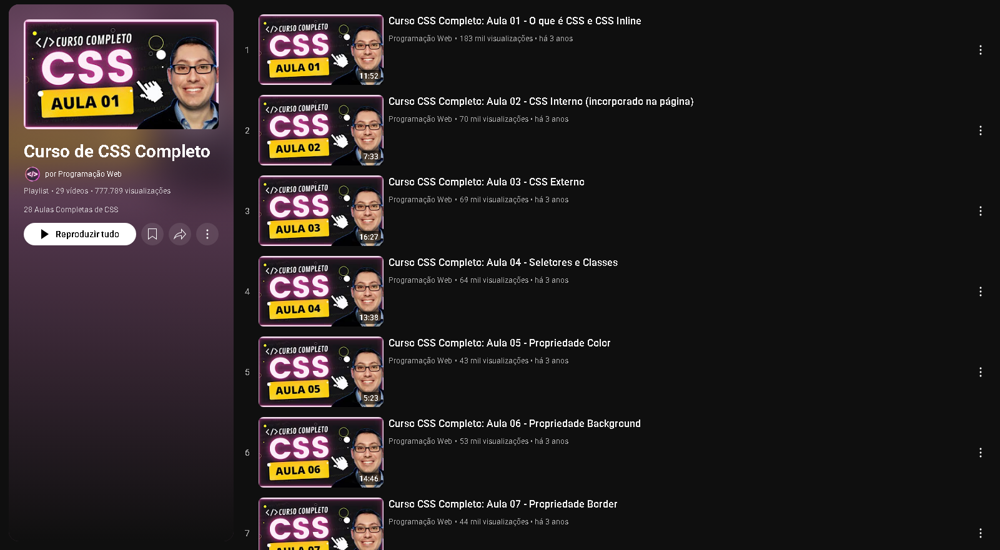
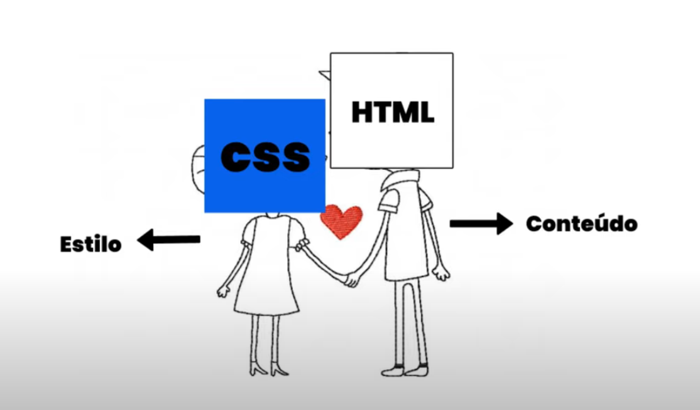

# 🎨 Curso de CSS - Programação Web   

Este repositório contém exemplos práticos e exercícios organizados em pastas, com o objetivo de documentar o aprendizado dos principais conceitos e propriedades do **CSS (Cascading Style Sheets)**.  

Em **2023**, entrei em um projeto de extensão na Anhembi Morumbi sem saber nada sobre desenvolvimento web. Foi então que encontrei este curso no YouTube e me surpreendi com o quanto consegui aprender em tão pouco tempo. Foram horas de dedicação que me proporcionaram uma base muito sólida em CSS.  

##  Referência de estudo

Durante meus estudos, utilizei a seguinte playlist do YouTube como base:

- [Curso CSS Completo ](https://www.youtube.com/playlist?list=PL2Fdisxwzt_f5C7Mv0kg1EAHhy2VJLf1c)

  

Cada diretório corresponde a um tópico específico, abordando desde a forma de incluir CSS em um projeto até propriedades fundamentais de estilização de elementos HTML.

---

## 🔹 Estrutura dos estudos  

- **css1 – CSS em linha:** aplicação de estilos diretamente nos elementos HTML via atributo `style`.  
- **css2 – CSS interno:** utilização da tag `<style>` no documento HTML para concentrar a estilização.  
- **css3 – CSS externo:** separação do código CSS em arquivos dedicados (`.css`), promovendo modularidade e manutenção.  
- **css4 – Classes e seletores:** definição de seletores e classes para aplicar estilos reutilizáveis a múltiplos elementos.  
- **css5 – Cores:** utilização de diferentes formatos de cores (`nomes`, `hexadecimal`, `rgb`, `hsl`).  
- **css6 – Background:** propriedades relacionadas ao plano de fundo (`background-color`, `background-image`, `background-repeat`, `background-size`).  
- **css7 – Border:** estilização de bordas (largura, cor, estilo e arredondamento com `border-radius`).  
- **css8 – Margin:** controle de espaçamento externo dos elementos.  
- **css9 – Padding e botões:** controle do espaçamento interno e aplicação prática em botões.  
- **css10 – Width e height:** definição de largura e altura de elementos.  
- **css11 – Text:** propriedades relacionadas ao texto (`text-align`, `text-transform`, `text-decoration`).  
- **css12 – Font:** estilização de fontes (`font-family`, `font-size`, `font-style`, `font-weight`).  
- **css13 – Estilização de links:** utilização de pseudo-classes (`:link`, `:visited`, `:hover`, `:active`).  
- **css14 – Display:** definição do comportamento dos elementos (`block`, `inline`, `inline-block`, `none`).  
- **css15 – Max-width:** definição de largura máxima de elementos, aplicada principalmente em layouts responsivos.  
- **css16 – Position:** posicionamento de elementos (`static`, `relative`, `absolute`, `fixed`, `sticky`).  
- **css17 – Overflow:** controle do conteúdo que ultrapassa o limite do container (`visible`, `hidden`, `scroll`, `auto`).  
- **css18 – Float:** posicionamento lateral de elementos e seu impacto no fluxo do layout.  
- **css19 – Opacity:** controle da transparência dos elementos, variando de `0` (invisível) a `1` (opaco).  

---

## 🚀 Objetivo  

- 📚 Consolidar fundamentos do CSS por meio de exemplos práticos.   
- 📝 Registrar a evolução no aprendizado de estilização para web.  

---

## 📌 Próximos tópicos de estudo  

- 🔄 Flexbox  
- 🧩 CSS Grid  
- 🎨 Animações e transições  
- ✨ Pseudo-elementos  
- 📱 Responsividade (media queries)  

 

---

